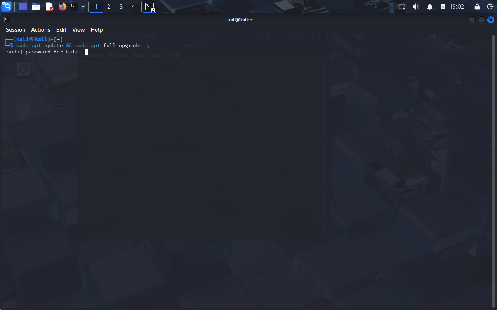
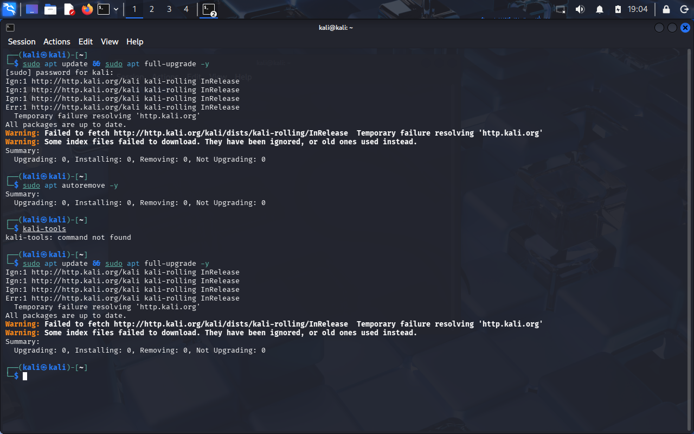
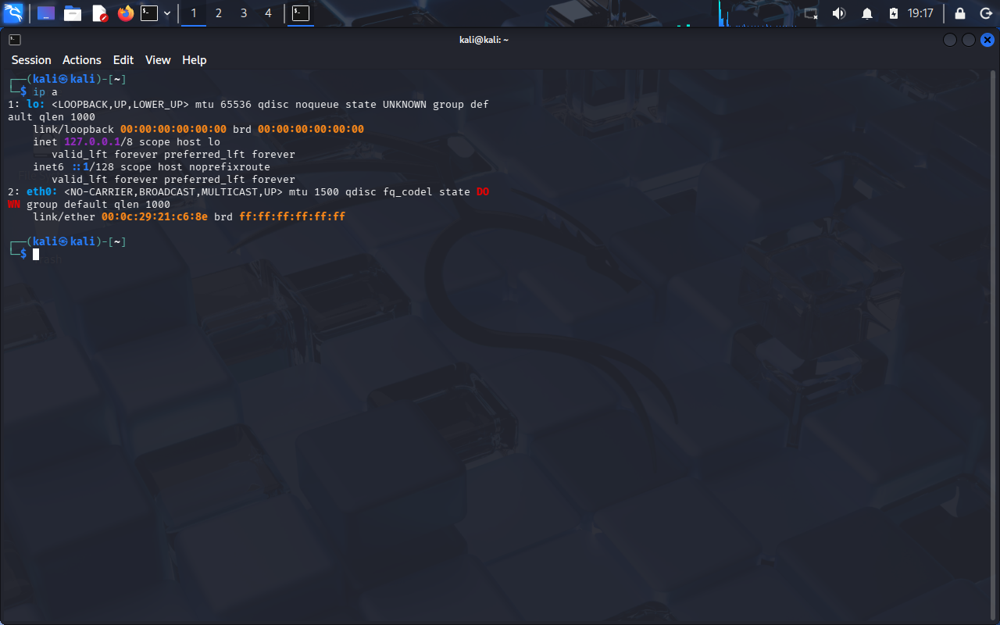
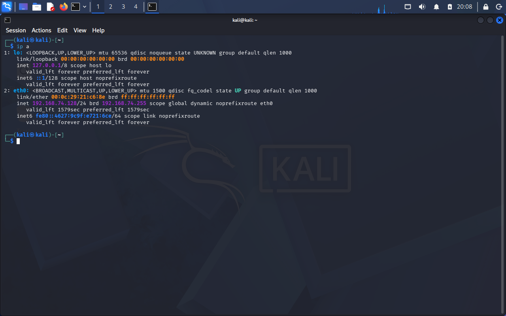
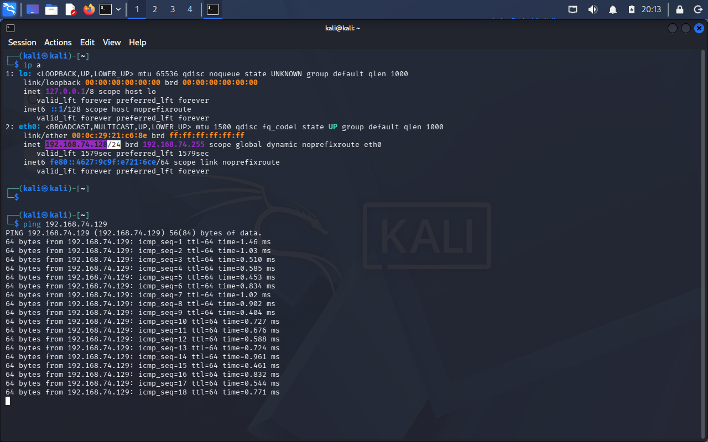
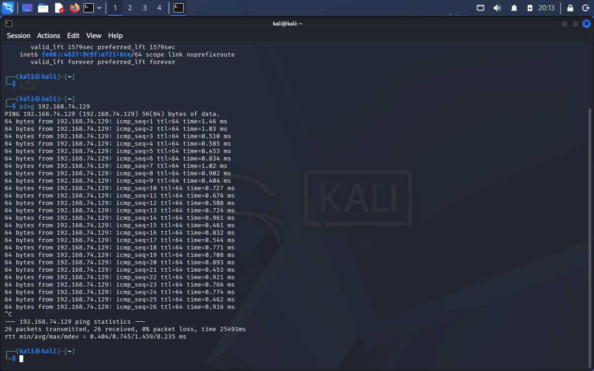

<div align="center">

# 🧱 Home Lab Setup  
## Kali Linux + Metasploitable2 + SEC401 Lab Environment


</div>

---

### 🎯 Objective

Build a functional cybersecurity lab environment using:

- Kali Linux (attacker machine)  
- Metasploitable2 (target machine)  
- Additional VMs used for SANS SEC401 labs  

The goal was to establish reliable networking, resolve connectivity issues, and prepare the lab for offensive security testing.

---

### 🧱 Lab Environment

## 🖥️ Attacker Machine

- OS: Kali Linux (VMware)
- Network: NAT

## 🎯 Target Machine

- OS: Metasploitable2
- Network: NAT

## 🧪 Additional Lab Systems

- Additional VMs configured for **SANS SEC401 labs**
- Used for expanded exercises beyond Metasploitable2

---

### ⚙️ Step 1 — Initial Kali Setup

Imported Kali Linux VM and attempted system update:

```bash
sudo apt update && sudo apt full-upgrade -y
```

📸 **Update Attempt**



---

### ❌ Step 2 — Network Failure

Encountered DNS resolution error:

```
Temporary failure resolving 'http.kali.org'
```

📸 **Error Output**



---

### 🔧 Step 3 — Troubleshooting Network

Verified network interfaces:

```bash
ip a
```

📸 **Interface Down**



---

### 🛠 Fix Applied

- Enabled VMware network adapter  
- Restarted VMware NAT & DHCP services  
- Restored default virtual network settings  
- Re-added network adapter  

---

### ✅ Step 4 — Network Restored

Confirmed valid IP assignment:

```bash
ip a
```

📸 **Interface Up**



---

### 🔄 Step 5 — System Update (Successful)

```bash
sudo apt update && sudo apt full-upgrade -y
sudo apt autoremove -y
reboot
```

---

### 🧱 Step 6 — Import Metasploitable2

- Imported `.vmx` file  
- Set network to NAT  

---

### 🌐 Step 7 — Verify Connectivity

From Kali:

```bash
ping 192.168.74.129
```

📸 **Ping Success**




---

### 📁 Lab Structure

```bash
~/lab/
├── ctf/
├── notes/
├── loot/
├── scripts/
├── writeups/
│   └── metasploitable2/
```

---

### 🧠 Key Takeaways

- Successfully configured VMware networking  
- Resolved DNS and connectivity issues  
- Verified communication between attacker and target  
- Integrated additional SEC401 lab machines  
- Built a stable foundation for exploitation labs  

---

<div align="center">

🧱 Lab environment successfully deployed  
🌐 Networking issues resolved  
🚀 Ready for exploitation and analysis  

</div>
